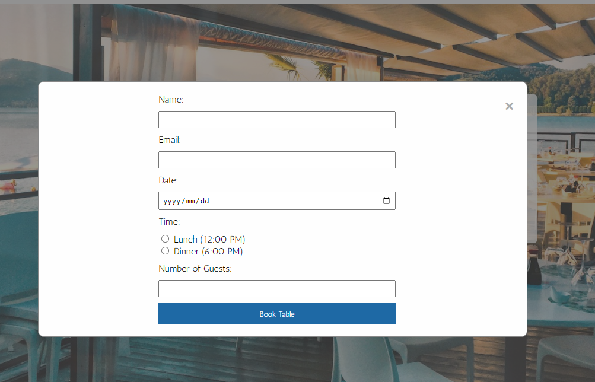
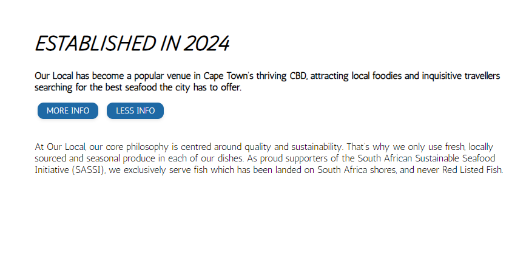
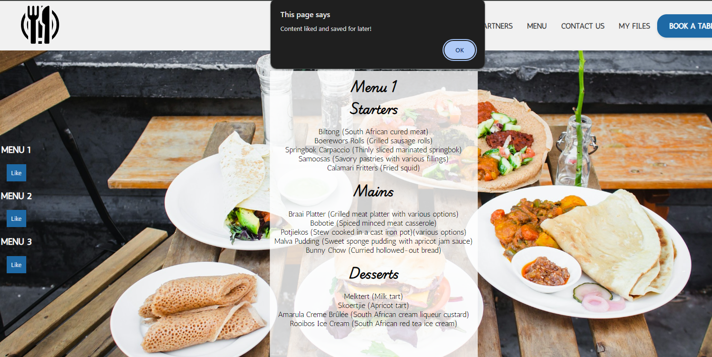
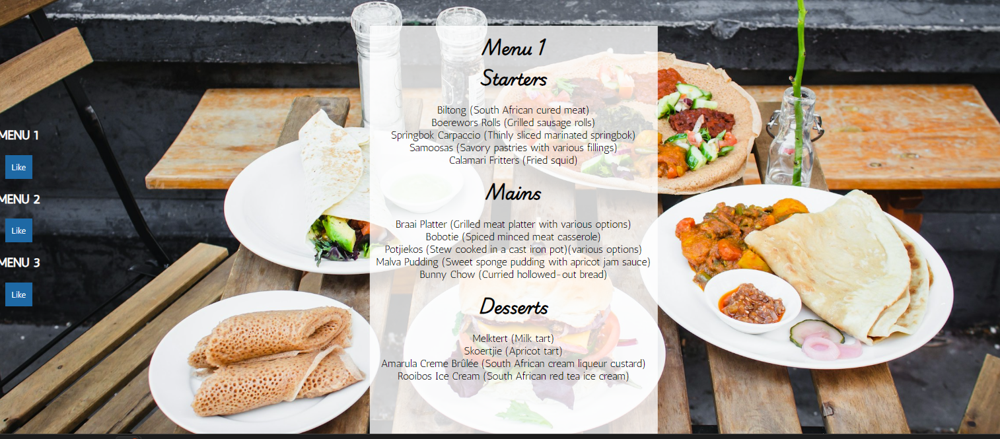
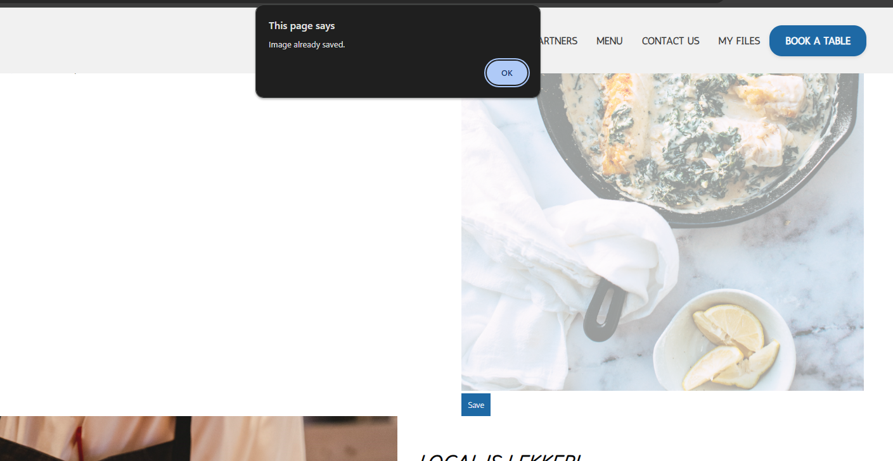
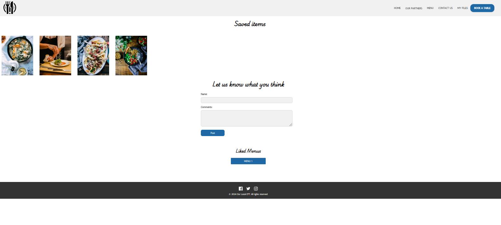

## My Front end project

I have built a website for a restaurant

### Table of Contents

* [My Front end project](#my-front-end-project)
* [Description](#description)
* [Installation](#installation)
* [Usage](#usage)

### Description
I have built a website for a restaurant, which includes a booking form, options to save content throughout the website as well as a "like" option. 
The website was created to test front-end skills, using HTML, CSS, Jquery and Vanilla Javascript functions. 
The website includes various layouts, animations and options to save data to a seperate landing page within the website.

### Installation
No specific installation required, you can clone the repo

### Usage
You can use this project as a template for other webpages, to use either complete pages, or other sections with the UX/UI and functionality you may need
see screenshot below for ease of use

###### As the main developer I would like to say:.
_Hope you enjoy using this code for your next project_

